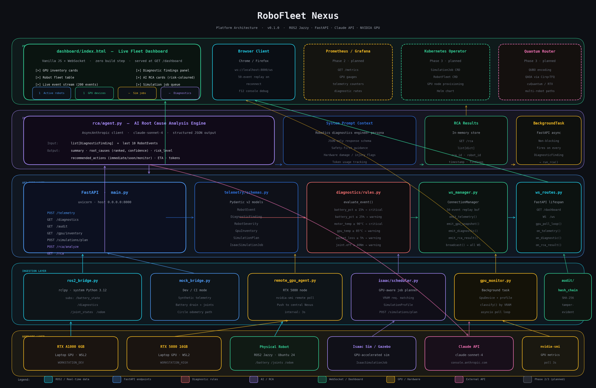
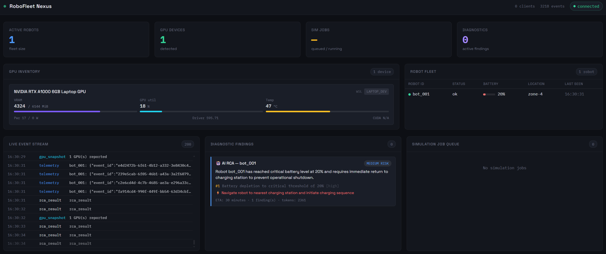
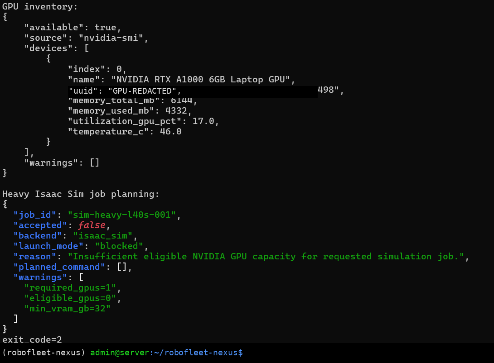
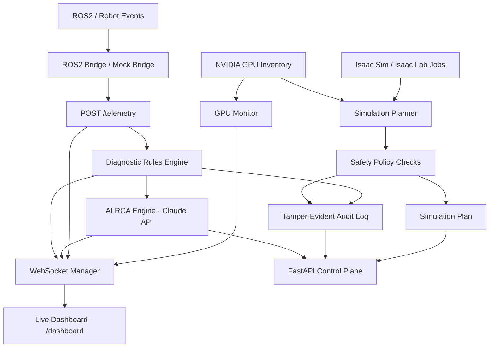

# RoboFleet Nexus

**AI-powered robotics fleet orchestration for ROS2, NVIDIA Isaac workflows, GPU-aware simulation scheduling, live observability, AI root-cause analysis, and tamper-evident auditability.**

[](https://github.com/amitb-gpu/robofleet-nexus/actions/workflows/ci.yml)


RoboFleet Nexus is a production-style robotics control plane that sits above robot middleware, simulation infrastructure, GPU resources, and AI diagnostic workflows. It does **not** replace ROS2, Isaac Sim, Isaac Lab, or robot-control systems. Instead, it connects them into a unified orchestration and observability layer.

> What is happening across my robot fleet, simulation jobs, telemetry streams, GPU resources, diagnostic findings, and safety-governed AI workflows — and what should happen next?

---

## Platform architecture



RoboFleet Nexus is organized as a layered control plane:

- **Dashboard / WebSocket layer** for live fleet visibility
- **FastAPI control plane** for telemetry, diagnostics, audit, GPU inventory, and simulation planning
- **ROS2 ingestion layer** for real robot telemetry via rclpy and mock development mode
- **NVIDIA GPU layer** for local and remote GPU inventory with simulation capability profiling
- **Isaac simulation planning layer** for GPU-aware workload admission
- **AI RCA layer** for Claude-powered structured root-cause analysis
- **Audit layer** for tamper-evident SHA-256 hash-chain event history

---

## Screenshots

### Live fleet dashboard



Real-time WebSocket dashboard showing GPU inventory, robot fleet table, live event stream, diagnostic findings, and AI RCA results. No page refresh required. Served at `http://localhost:8000/dashboard` with zero frontend build tooling.

### GPU-aware Isaac workload blocking

A heavy Isaac Sim job is rejected before launch when the local GPU does not meet the requested VRAM threshold.



On a 6 GB RTX A1000 laptop GPU, the planner returns `accepted: false` with an insufficient VRAM reason.

---

## Why this project exists

Modern robotics stacks are powerful but fragmented. A robotics team may use ROS2 for robot communication, Isaac Sim for simulation, Isaac Lab for robot learning, NVIDIA GPUs for simulation and synthetic-data workloads, custom scripts for telemetry, and separate dashboards for observability.

RoboFleet Nexus provides a unified control-plane layer across those systems.

---

## What this project is

RoboFleet Nexus is:

- a live robotics fleet observability platform with real-time WebSocket dashboard
- a ROS2 Jazzy telemetry ingestion and diagnostic pipeline (rclpy bridge)
- a GPU-aware NVIDIA Isaac simulation planner
- an AI-powered root-cause analysis engine (Claude API)
- a CLI-driven simulation job planning tool
- a FastAPI service for telemetry, diagnostics, GPU inventory, audit, and simulation planning
- a tamper-evident SHA-256 hash-chain decision and event audit trail
- a foundation for Kubernetes GPU scheduling, digital twins, and fleet autonomy

RoboFleet Nexus is **not**:

- a physics simulator
- a replacement for Isaac Sim, Isaac Lab, or ROS2
- a direct physical robot controller
- an autonomous robot-command agent

The platform may plan, validate, recommend, and audit. Physical robot command paths remain policy-gated.

---

## Core capabilities

### Implemented and verified (v0.1.0)

- **Live WebSocket dashboard** — real-time fleet visibility at `/dashboard`, zero build step, 50-event replay buffer for new clients
- **ROS2 Jazzy bridge** — rclpy subscriber for `/battery_state`, `/diagnostics`, `/joint_states`, `/odom`; runs on system Python 3.12 decoupled from conda environment
- **Mock bridge** — synthetic telemetry publisher for dev and CI without physical hardware
- **GPU monitoring** — `nvidia-smi` background poll every 3 seconds; auto-classifies devices into `LAPTOP_DEV` / `WORKSTATION_DEV` / `WORKSTATION_HIGH` / `PRODUCTION` profiles
- **Remote GPU agent** — pushes GPU metrics from any node (RTX 5080, Jetson) to the central Nexus instance over HTTP
- **AI RCA engine** — Claude API (claude-sonnet-4-6) analyses diagnostic findings against recent telemetry context; returns ranked root causes, confidence levels, risk rating, and prioritised remediation steps
- **Diagnostic rules engine** — battery low/critical, motor/GPU temperature, packet loss, joint effort thresholds
- **Tamper-evident audit log** — SHA-256 hash-chain for all ingestion, findings, simulation plans, and GPU checks
- **Isaac Sim job planner** — GPU-capacity-aware workload admission with simulation environment profiles
- **FastAPI control plane** — typed Pydantic schemas, async endpoints, BackgroundTasks for non-blocking RCA
- **CLI simulation planning** — YAML and JSON job loading, `--fail-on-blocked` flag

### Planned (Phase 2–3)

- Prometheus / Grafana metrics export
- JWT auth and multi-tenant organisation scoping
- Policy-as-code engine (YAML geofencing, battery thresholds, GPU limits)
- Isaac Lab experiment tracking and ML pipeline
- Kubernetes operator with `SimulationJob` and `RobotFleet` CRDs
- Digital twin state layer (live per-robot state mirror)
- Quantum-optimised multi-robot routing (QUBO + QAOA via Cirq + TFQ + cuQuantum)
- Plugin marketplace for diagnostic rules and sensor adapters

---

## NVIDIA robotics orchestration layer

RoboFleet Nexus treats NVIDIA robotics infrastructure as orchestration targets rather than systems to reimplement. The platform sits above Isaac Sim, Isaac Lab, Isaac ROS / ROS2 bridge workflows, and NVIDIA GPUs for simulation and acceleration workloads.

The current scheduler does not launch physical robot commands. It creates a structured simulation plan, checks GPU capacity, applies safety policy, and returns an auditable decision.

Example behavior:

- a lightweight mock simulation job runs in CI or on a laptop GPU
- a heavy Isaac Sim job requesting 32 GB VRAM is blocked on a 6 GB RTX A1000 laptop GPU
- GPU profiles route workloads to the appropriate node automatically

---

## Architecture



---

## Current API surface

```text
GET  /health
POST /telemetry
GET  /diagnostics
GET  /audit
GET  /gpu/inventory
GET  /simulations/profiles
POST /simulations/plan
POST /rca/analyze
GET  /rca
GET  /dashboard
WS   /ws
```

---

## Quick start

### Prerequisites

- Python 3.11+ (conda recommended)
- NVIDIA GPU with `nvidia-smi` available
- Anthropic API key for AI RCA (`console.anthropic.com`)
- ROS2 Jazzy (optional — mock mode works without it)

### Install

```bash
git clone https://github.com/amitb-gpu/robofleet-nexus.git
cd robofleet-nexus
pip install -e ".[dev]"
export ANTHROPIC_API_KEY=sk-ant-...
```

### Run the platform

```bash
# Terminal 1 — API server
uvicorn robofleet_nexus.api.main:app --host 0.0.0.0 --port 8000 --reload

# Terminal 2 — mock robot bridge (no ROS2 needed)
python -m robofleet_nexus.adapters.ros2_bridge --mock --robot-id bot_001

# Browser
open http://localhost:8000/dashboard
```

### Run with real ROS2

```bash
# Source ROS2 first — uses system Python 3.12
source /opt/ros/jazzy/setup.bash
PYTHONPATH=/path/to/robofleet-nexus/src \
  /usr/bin/python3 -m robofleet_nexus.adapters.ros2_bridge \
  --robot-id bot_001 --nexus-url http://localhost:8000
```

### Trigger AI RCA manually

```bash
curl -s -X POST http://localhost:8000/telemetry \
  -H "Content-Type: application/json" \
  -d '{
    "event_id": "test-001",
    "robot_id": "bot_001",
    "source": "mock",
    "event_type": "battery_state",
    "subsystem": "power",
    "message": "Battery at 14.0%",
    "metrics": {"battery_pct": 14.0},
    "metadata": {}
  }'
```

The dashboard diagnostic findings panel will show a Claude-generated RCA card within 1–3 seconds.

### Run tests and checks

```bash
PYTHONPATH=src pytest -q
ruff check src tests
mypy src
```

---

## CLI simulation planning examples

Plan a CI-safe mock simulation job:

```bash
robofleet simulations plan examples/simulations/isaac_warehouse_nav.yaml
```

Plan a heavy Isaac Sim workload — blocked on a 6 GB laptop GPU:

```bash
robofleet simulations plan examples/simulations/isaac_heavy_l40s.yaml --fail-on-blocked
```

---

## Simulation environment profiles

| Profile | Purpose | Isaac Sim | Isaac Lab | Synthetic Data |
| --- | --- | --- | --- | --- |
| `ci_mock` | GitHub Actions and unit tests | No | No | No |
| `laptop_dev` | API development and lightweight GPU checks | No | No | No |
| `workstation_l40s` | Single-node NVIDIA L40S workstation | Yes | Yes | Yes |
| `production_gpu_node` | Future Kubernetes GPU node | Yes | Yes | Yes |

---

## Repository structure

```text
robofleet-nexus/
├── docs/
│   ├── assets/
│   │   ├── robofleet_nexus_architecture.png
│   │   ├── dashboard_overview.png
│   │   └── cli_gpu_blocked.png
│   ├── RoboFleet_Nexus_Architecture_Walkthrough.md
│   ├── RoboFleet_Nexus_Platform_Overview.docx
│   └── nvidia_isaac_architecture.md
├── examples/
│   └── simulations/
│       ├── isaac_warehouse_nav.yaml
│       └── isaac_heavy_l40s.yaml
├── src/
│   └── robofleet_nexus/
│       ├── adapters/          # ROS2 bridge, mock bridge, remote GPU agent
│       ├── api/               # FastAPI app, WebSocket manager and routes
│       ├── audit/             # SHA-256 hash-chain audit log
│       ├── cli/               # Typer CLI
│       ├── core/              # GPU monitor
│       ├── dashboard/         # index.html live dashboard
│       ├── diagnostics/       # Diagnostic rules engine
│       ├── gpu/               # GPU inventory
│       ├── isaac/             # Simulation job spec, scheduler, profiles
│       ├── rca/               # AI root-cause analysis agent
│       └── telemetry/         # Pydantic schemas
├── tests/
├── pyproject.toml
└── README.md
```

---

## Documentation

- [`docs/RoboFleet_Nexus_Architecture_Walkthrough.md`](docs/RoboFleet_Nexus_Architecture_Walkthrough.md) — layer-by-layer component guide and end-to-end data flow
- [`docs/RoboFleet_Nexus_Platform_Overview.docx`](docs/RoboFleet_Nexus_Platform_Overview.docx) — investor and stakeholder overview document
- [`docs/nvidia_isaac_architecture.md`](docs/nvidia_isaac_architecture.md) — NVIDIA Isaac integration architecture

---

## Safety model

Allowed without human approval: read-only telemetry inspection, GPU inventory checks, simulation dry-run planning, diagnostic finding creation, audit-log reads, mock simulation planning.

Policy-gated: Isaac Sim job execution, Isaac Lab experiment execution, Kubernetes job creation, ROS2 node restart, robot mission modification.

Blocked by design: direct physical robot command paths from AI workflows, safety override requests without policy approval, unbounded launch loops, silent mutation of audit history.

---

## Design principles

1. Do not replace Isaac Sim.
2. Do not bypass ROS2.
3. Do not let AI directly control physical robots.
4. Keep diagnostics evidence-based.
5. Make every scheduling and diagnostic decision auditable.
6. Treat GPU capacity as a first-class scheduling constraint.
7. Keep CI and developer workflows useful without requiring Isaac Sim or a physical robot.
8. Build with production software engineering practices.

---

## License

MIT License.

---

## Status

RoboFleet Nexus v0.1.0 is a functional open-source robotics orchestration platform verified on NVIDIA RTX A1000 + ROS2 Jazzy hardware. The current implementation plans, validates, diagnoses, audits, and demonstrates GPU-aware orchestration with live AI-powered root-cause analysis.

Built with FastAPI · ROS2 Jazzy · NVIDIA Isaac · Anthropic Claude · Python 3.12
